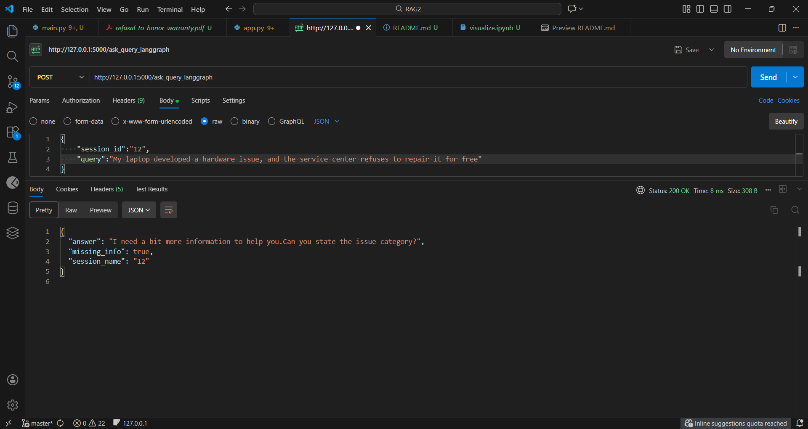
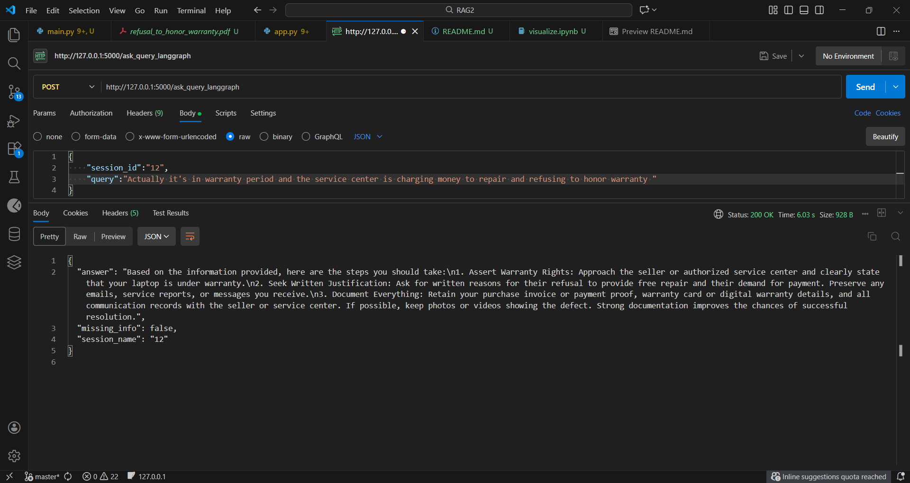
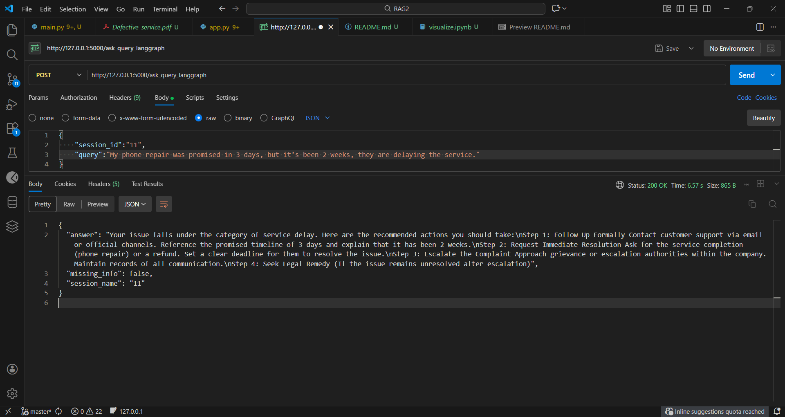
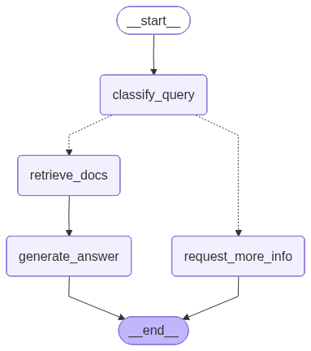

# Consumer Rights Assistant(RAG + LangGraph)

This is a flask based consumer assistant, which replies to consumer queries according to the consumer rights pdfs which is stored in vector database as chunks(Pinecone). It uses LangGraph to generate response of the complaint in a sequential manner. Also, it ask questions and followups if category of the query is unidentified.

## Features:

### app.py
* '/index' POST: 
    1. To upload the directory using DirectoryLoader, which contains 4 pdfs.
    2. Split the text using RecursiveCharacterTextSplitter in chunk size of 300 and overlapping of 38. 
    3. Upload the vectors in Pinecone's index.
    4. returns the status, and the length of the chunks.

* '/ask_query' POST: RAG application
    1. Accept the query and convert it into a query vector.
    2. generate the reuslt with top_k responses(3).
    3. Write the prompt using ChatPromptTemplate.from_template which asks the RAG system to answer the
       queries according to the context.
    4. To generate all the responses in string format using StrOutputParser().
    5. And, return the output.

* '/ask_query_langgraph' POST: RAG application with LangGraph
    1. To accept the query and session_id
    2. To the store the current session conversation
    3. To generate response according to nodes and edges, and followups if the category of the query is not identified.

* def classify_query(): To classfiy the issue category, whether it is defective_service, delay_service, refusal_to_honor_warranty,
   or overcharging_service.
* def request_more_info(): To request more information about the query, if issue_category is missing.
* def retrieve_docs(): To retrieve the consumer rights documents if all the functions are satisfied.
* def generate_answer(): To generate answers after retrieving the consumer rights pdf, according to the
  given prompt.
* def route_logic(): For conditional edges, to retrieve_docs if classify_query is satisfied or request_more_info if it's missing.

* LLM used: gemini-2.5-flash
* Embedding model: text-embedding-004

* API Keys:
    1. GEMINI_API_KEY
    2. PINECONE_API_KEY
* Vector Database: Pinecone, with dimension as 768(according to the embedding model) and metric=cosine

### visualize_graph.ipynb: 
* Visualize the edges and nodes using mermaid

### Technologies used:

1. Flask
2. LangGraph
3. LangChain
4. Pincone
5. gemini-2.5-flash

## Sample Outputs:

1. 

2. 

3. Graph of Nodes and edges

